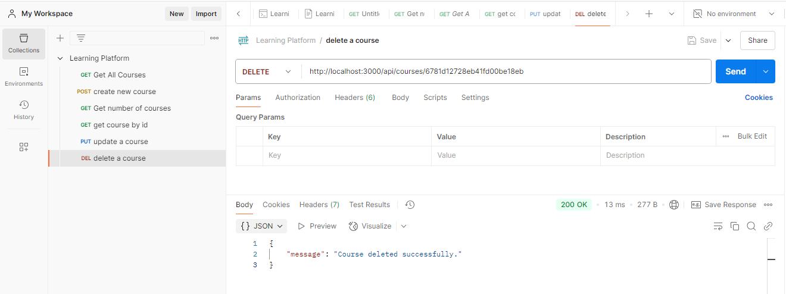

# Projet de Backend pour une Plateforme d'Apprentissage en Ligne

Ce projet consiste à créer une API backend pour une plateforme d'apprentissage en ligne. Le code est structuré de manière modulaire pour faciliter la maintenance et l'évolution du projet. Cette API utilise MongoDB pour la gestion des données et Redis pour la gestion du cache.

#  Questions / Réponses :

## Questions sur les Variables d'Environnement (env.js)

**Question** : Pourquoi créer un module séparé pour les connexions aux bases de données ?

**Réponse** : Cela permet de centraliser la gestion des connexions aux bases de données, facilitant ainsi la maintenance et la réutilisation du code. Cela permet également de séparer les préoccupations, rendant le code plus modulaire et plus facile à tester.

**Question** : Comment gérer proprement la fermeture des connexions ?

**Réponse** : On  peut gérer la fermeture des connexions en écoutant les événements de fermeture de l'application (comme process.on('SIGINT')) et en appelant les méthodes de fermeture des clients MongoDB et Redis.

## Questions sur la Base de Données (db.js)

**Question** : Pourquoi est-il important de valider les variables d'environnement au démarrage ?

**Réponse** :  Valider les variables d'environnement au démarrage permet de s'assurer que toutes les configurations nécessaires sont présentes avant que l'application ne commence à fonctionner. Cela évite des erreurs inattendues pendant l'exécution et facilite le débogage.

**Question** : Que se passe-t-il si une variable requise est manquante ?

**Réponse** :  Si une variable requise est manquante, l'application doit lever une erreur explicative et arrêter son exécution. Cela permet de corriger le problème avant que l'application ne soit utilisée.

## Questions sur les Contrôleurs (courseController.js)

**Question** :Quelle est la différence entre un contrôleur et une route ?

**Réponse**  :Un contrôleur contient la logique métier de l'application, tandis qu'une route définit les points d'entrée de l'API et délègue les requêtes aux contrôleurs 

**Question** : Pourquoi séparer la logique métier des routes ?

**Réponse** :Séparer la logique métier des routes permet de rendre le code plus modulaire, réutilisable et plus facile à tester. Cela permet également de maintenir une séparation claire des préoccupations.

## Questions sur les Routes (courseRoutes.js)

**Question**: Pourquoi séparer les routes dans différents fichiers ?

**Réponse** : Séparer les routes dans différents fichiers permet de mieux organiser le code, de le rendre plus lisible et de faciliter la maintenance. Cela permet également de regrouper les routes par fonctionnalité ou par module, ce qui respecte le principe de séparation des responsabilités.

**Question**: Comment organiser les routes de manière cohérente ?

**Réponse** : Organiser les routes de manière cohérente implique de regrouper les routes par fonctionnalité ou par module, d'utiliser des noms de chemins clairs et descriptifs, et de suivre une structure RESTful pour les méthodes HTTP.

## Questions sur les Services (mongoService.js)

**Question**:Pourquoi créer des services séparés ?

**Réponse** : Créer des services séparés permet de centraliser la logique de manipulation des données, de rendre le code plus modulaire et réutilisable, et de faciliter les tests unitaires et la maintenance.

## Questions sur Redis (redisService.js)

**Question**:Comment gérer efficacement le cache avec Redis ?

**Réponse** : Utiliser des fonctions utilitaires pour mettre en cache et récupérer les données, gérer les TTL (time-to-live) pour les clés, et s'assurer que le client Redis est correctement initialisé.

**Question**:Quelles sont les bonnes pratiques pour les clés Redis ?

**Réponse** :  Utiliser des noms de clés clairs et descriptifs, inclure des préfixes pour les regrouper par fonctionnalité, et gérer les TTL pour éviter une utilisation excessive de la mémoire.

## Questions sur l'application (app.js)

**Question**: Comment organiser le point d'entrée de l'application ?

**Réponse**  Le point d'entrée d'une application initialise et démarre l'application en configurant les connexions, les middlewares, les routes, et le serveur. Pour une bonne organisation, il est essentiel de séparer les préoccupations en plaçant les configurations complexes dans des fichiers séparés. Le démarrage du serveur doit être asynchrone pour garantir que toutes les connexions nécessaires sont établies avant d'accepter des requêtes. Enfin, la gestion des erreurs doit être claire, par exemple, en évitant de démarrer le serveur si la connexion à la base de données échoue.

**Question**: Quelle est la meilleure façon de gérer le démarrage de l'application ?

**Réponse** : La gestion du démarrage de l'application peut être optimisée en suivant ces bonnes pratiques : assurez-vous que toutes les connexions aux bases de données et services externes (comme Redis) sont établies avant de démarrer le serveur, en utilisant async/await pour attendre leur réussite. Le démarrage du serveur doit être asynchrone, permettant de lancer les connexions avant de commencer à accepter les requêtes. Enfin, il est crucial de gérer les erreurs de démarrage en empêchant le serveur de démarrer si une connexion échoue, avec un message d'erreur explicite.

## Questions sur les Variables d'Environnement  (env)

**Question**: Quelles sont les informations sensibles à ne jamais commiter ?

**Réponse** :Les informations sensibles à ne jamais commiter incluent les URI des bases de données, les clés API, les mots de passe, et toute autre information confidentielle qui pourrait compromettre la sécurité de l'application.

**Question**: Pourquoi utiliser des variables d'environnement ?

**Réponse** : Les variables d'environnement permettent de séparer la configuration du code source, facilitant ainsi la gestion des différentes configurations pour les environnements de développement, de test et de production. Elles aident également à protéger les informations sensibles en les stockant en dehors du code source.

# Configuration du projet

1. Cloner le dépôt

git clone https://github.com/Ouma49/learning-platform-nosql

cd learning-platform-nosql

2. Installation des dépendances

Pour installer les dépendances nécessaires au projet, exécutez la commande suivante:

npm install

3. Lancer les services requis

    Pour démarrer la base de données MongoDB, utilisez la commande suivante :

     mongod

Pour démarrer le serveur Redis, exécutez cette commande :

    redis-server

# Structure du projet

Le projet est organisé de manière claire et logique pour faciliter son développement et sa gestion. Voici un détail des différents fichiers et dossiers :

    db.js : Ce fichier gère les connexions aux bases de données MongoDB et Redis.

    env.js : Il est responsable de la gestion des variables d'environnement, en les chargeant depuis le fichier .env.

src/controllers :

    courseController.js : Ce fichier contient la logique métier associée aux cours, comme la gestion de leur création, modification, et suppression.

src/routes :

    courseRoutes.js : Il définit les routes API permettant d'interagir avec les ressources liées aux cours.

src/services :

    mongoService.js : Ce service regroupe les fonctions permettant d'interagir avec MongoDB.

    redisService.js : Ce service est dédié aux interactions avec Redis pour gérer le cache.

src/app.js : C'est le point d'entrée de l'application. Il initialise le serveur, configure les middlewares et enregistre les routes.

.env : Ce fichier contient des informations sensibles comme les URI des bases de données et les clés API, afin de les protéger dans le code source.

package.json : Ce fichier décrit les dépendances du projet et fournit des scripts pour faciliter le développement et le déploiement.

# Choix Techniques pour le Projet

### 1. Utilisation de Postman pour Tester l'API

Le choix de Postman pour tester et interagir avec l'API repose sur ses capacités avancées et sa facilité d'utilisation. Postman offre une interface graphique intuitive qui permet de simuler des requêtes HTTP, d'inspecter les réponses, et de vérifier la conformité des données retournées par l'API. Cet outil est particulièrement utile pour l'automatisation des tests, facilitant le développement et le débogage des services API.

    Requête POST : Utilisée pour envoyer des données à l'API, permettant la création de nouvelles ressources sur le serveur.
    Requête GET : Permet de récupérer les données stockées sur le serveur, assurant l'accès aux informations disponibles.
    Requête DELETE : Utilisée pour supprimer une ressource spécifique identifiée par son ID, garantissant une gestion efficace des ressources.
    Requête PUT : Permet de mettre à jour une ressource existante, en modifiant ses attributs selon les données fournies.

Ces types de requêtes ont été essentiels pour tester le bon fonctionnement de l'API, en s'assurant que les opérations de création, récupération et suppression de ressources sont correctement implémentées.

### 2. Utilisation de MongoDB Compass pour la Gestion de la Base de Données

MongoDB Compass a été choisi pour gérer la base de données, offrant une interface graphique qui simplifie la visualisation et la manipulation des données stockées dans MongoDB. Ce choix technique a permis de vérifier rapidement les entrées de données, de valider les requêtes, et d'assurer l'intégrité des données.

    Visualisation : MongoDB Compass permet de visualiser facilement les documents, les collections, et les bases de données, aidant à une gestion efficace.
    Validation : L'outil facilite la validation des données et la mise en place de règles de schéma pour maintenir la cohérence des données.

# Documentation Visuelle des Endpoints de l'API

### Récupération de tous les cours (GET /api/courses)

Cette capture d'écran montre la réponse d'une requête GET vers l'endpoint `/api/courses`. Elle illustre la récupération de la liste complète des cours disponibles dans la plateforme d'apprentissage. La réponse en format JSON contient plusieurs cours avec leurs détails

### Création d'un nouveau cours (POST /api/courses)

Cet endpoint permet d'ajouter un nouveau cours dans la base de données. Il nécessite les informations suivantes :
- Titre du cours
- Description
- Auteur

  

### Comptage de nombre des cours (GET /api/courses/stats)

Cette capture affiche les statistiques des cours via une requête GET vers `/api/courses/stats`. La réponse inclut le nombre total de cours et la liste des titres des cours disponibles dans la plateforme.

### Récupération d'un cours par ID (GET /api/courses/{id})

Cette capture montre la récupération des détails d'un cours spécifique via une requête GET vers `/api/courses/{id}`. La réponse inclut toutes les informations du cours "JAVA" avec son ID, titre, description et instructeur.

### Mise à jour d'un cours (PUT /api/courses/{id})

Cette capture illustre la mise à jour d'un cours existant via une requête PUT vers `/api/courses/{id}`. La requête modifie le titre du cours en "JAVA OOP" et la réponse confirme la mise à jour réussie avec les nouvelles informations.

###  Suppression d'un cours (DELETE /api/courses/{id})

Cette capture illustre la suppression d'un cours spécifique via une requête DELETE vers `/api/courses/{id}`. La réponse avec le statut 200 OK confirme que le cours a été supprimé avec succès.

### Terminal - Démarrage du serveur

Cette capture montre le terminal avec le démarrage du serveur Node.js. On peut voir les connexions réussies à MongoDB et Redis, ainsi que le démarrage du serveur sur le port 3000. Des informations sur le cache et les IDs des cours sont également affichées.

 
